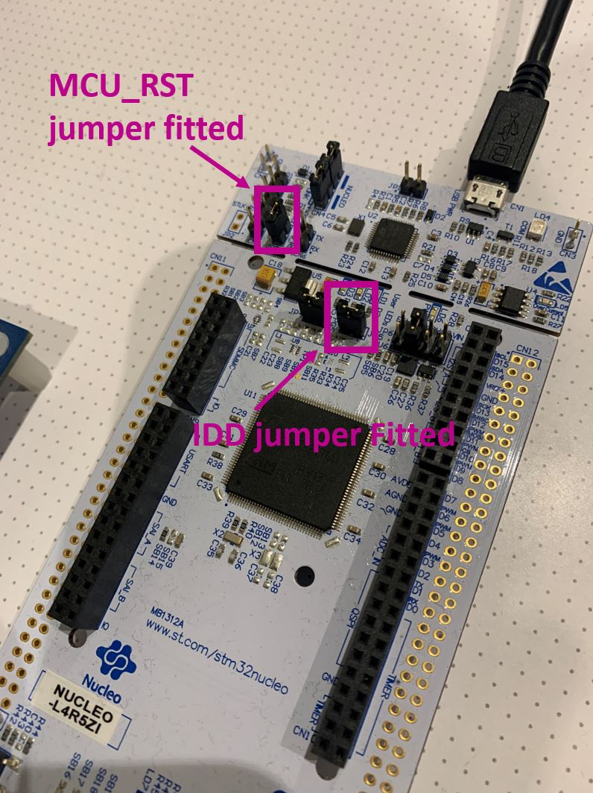
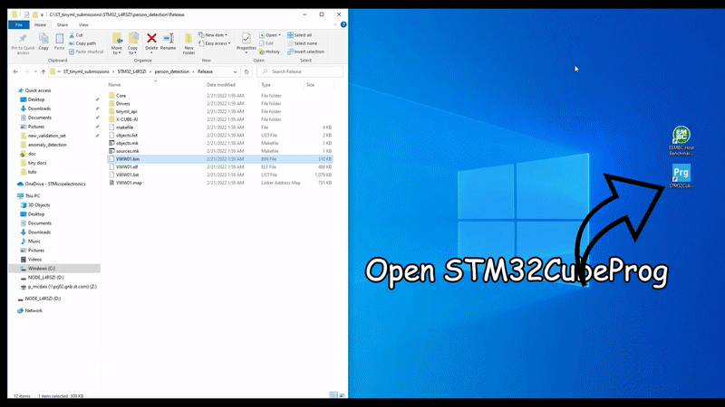

# Energy Mode for NUCLEO-L4R5ZI

In this guide, we will learn how to excute the energy mode.

## Before You Start
You need to download and install the following software:

- [STM32CubeMX](https://www.st.com/en/development-tools/stm32cubemx.html)   ( v6.4.0 )
- [STM32CubeIDE](https://www.st.com/en/development-tools/stm32cubeide.html)  ( v1.8.0 )
- [STM32CubeProg](https://www.st.com/en/development-tools/stm32cubeprog.html) ( v2.9.0 )

The following Nucleo board is required:

- [NUCLEO-L4R5ZI](https://www.st.com/en/evaluation-tools/nucleo-l4r5zi.html#sample-buy)

## Energy mode setup

For energy mode the **EE_CFG_ENERGY_MODE** flag should be set to **1**.

### Flash the board using STM32CubeProg

Next we will demonstarte how to flash your NUCLEO-L4R5ZI board with the binary (.bin) file you generated after setting the **EE_CFG_ENERGY_MODE** flag to 1.

**1. Verify the board configuration:**

Make sure that your board has the the following jumpers fitted:

**2. Flash the board:**

Connect the board to the laptop using a usb cable and use STM32CubeProg to flash the board as the following:

### Hardware setup

You need to make sure that the **MCU_RST** and the **IDD** jumpers are **not fitted**.

The final setup should look like the following:

**Make sure to push the Reset Button (the Black Button) on the board before starting the benchmark software.**

For more details about the energy benchmark and EEMBCs EnergyRunner™ benchmark framework please refer to this [link](https://github.com/eembc/energyrunner) 